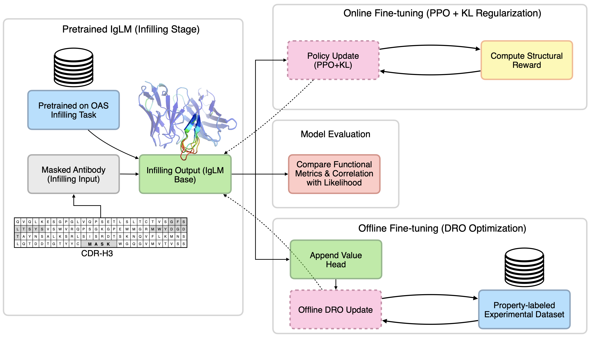

<div align="left">
  <h2>
    <picture>
    <source media="(prefers-color-scheme: dark)" srcset="images/proteintunerl-logo-name-dark.png" width="350">
    <source media="(prefers-color-scheme: light)" srcset="images/proteintunerl-logo-name-light.png" width="350">
    
    </picture>
  </h2>
</div>


[](LICENSE)

**ProteinTuneRL** is a flexible framework for protein sequence optimization using **infilling language models** and **reinforcement learning (RL)**. It supports general-purpose protein design and provides targeted tools for antibody engineering.

At its core, ProteinTuneRL uses **IgLM** — a transformer-based infilling model — to generate or modify specific regions (e.g. CDR loops) of protein sequences while preserving framework context. It combines this with online and offline RL to steer generation toward desirable properties like stability or binding affinity.

<div align="center">
  
  <p><em>Overview of ProteinTuneRL's antibody infilling and optimization process</em></p>
</div>

---

## 🔬 Key Features

* **Infilling-Based Generation**: Uses [IgLM](https://www.cell.com/cell-systems/fulltext/S2405-4712(23)00271-5?_returnURL=https%3A%2F%2Flinkinghub.elsevier.com%2Fretrieve%2Fpii%2FS2405471223002715%3Fshowall%3Dtrue) to redesign specific regions (e.g. antibody loops) while attending to the surrounding context.
* **Reinforcement Learning**: Supports **online RL** (via PPO with KL regularization) and **offline RL** (via [DRO](https://arxiv.org/abs/2405.19107)) to fine-tune models for task-specific objectives.
* **Antibody Design Ready**: Built-in support for CDR infilling and developability-aware optimization.
* **General Protein Design**: Flexible masking and reward customization allow applications beyond antibodies.

---

## 🧠 How It Works

1. **Infilling Model (IgLM)**
   Protein sequences are modified using IgLM, which can “fill in” masked regions (like CDR loops) of user-defined length based on surrounding context.

2. **Online RL (PPO)**
   IgLM is fine-tuned using **Proximal Policy Optimization** to maximize a custom reward function while staying close to the original model.

3. **Offline RL (DRO)**
   A lightweight, sample-efficient method to align IgLM with empirical data from fixed datasets.

---

## 🚀 Quickstart

### 1) Create a Python environment

Using **venv**:

```bash
python3.9 -m venv .venv
source .venv/bin/activate   # Windows: .venv\Scripts\activate
python -m pip install -U pip
```

Now install ProteinTuneRL:

```bash
git clone https://github.com/LLNL/protein_tune_rl.git
cd protein_tune_rl
pip install -e '.'
```

### 2) Provide an Infilling Model Directory (IgLM **weights only**)

ProteinTuneRL expects an **infilling language model**. Currently, it is designed to work with **IgLM** ([https://github.com/Graylab/IgLM/tree/main](https://github.com/Graylab/IgLM/tree/main)), which is specifically tailored for antibody design tasks.
ProteinTuneRL does **not** require the IgLM Python package to be installed.  It only needs a directory containing the **IgLM pretrained weights and tokenizer files**. All examples assume a single path (referred to as `IGLM_DIR`) that points to such a directory.

**Option A — Clone IgLM to obtain the weights (no install)**

```bash
# You can clone this anywhere (inside or outside this repo)
git clone https://github.com/Graylab/IgLM.git
# Use the pretrained weights shipped in the repo, e.g.:
# IgLM/trained_models/IgLM-S
```

**Option B — Use any existing weights directory**
If you already have IgLM weights (e.g., downloaded elsewhere), just note the absolute path to that directory.

---

### Example: Optimize CDR Loops with Online RL

This example fine-tunes IgLM with PPO on HCDR3 for a β-sheet objective.

**What you must set in the config**
Update the IgLM paths to match your installation:

* `tokenizer.tokenizer_config` → the IgLM model directory (e.g., `$IGLM_DIR`)
* `policy_model.dir` → the same IgLM model directory

**Run**
Run the following command to optimize CDR loops using Proximal Policy Optimization (PPO):

```bash
python protein_tune_rl/tune.py --config-file configs/examples/ppo_iglm_hcdr3_beta_sheet.json
```

---

## 🛠 Development

```bash
pip install -e '.[dev]'
black -S -t py39 protein_tune_rl
flake8 --ignore=E501,E203,W503 protein_tune_rl
isort protein_tune_rl
```

---

## 📄 License

Released under the [MIT License](LICENSE). <br>
SPDX-License-Identifier: MIT <br>
LLNL-CODE-2006374